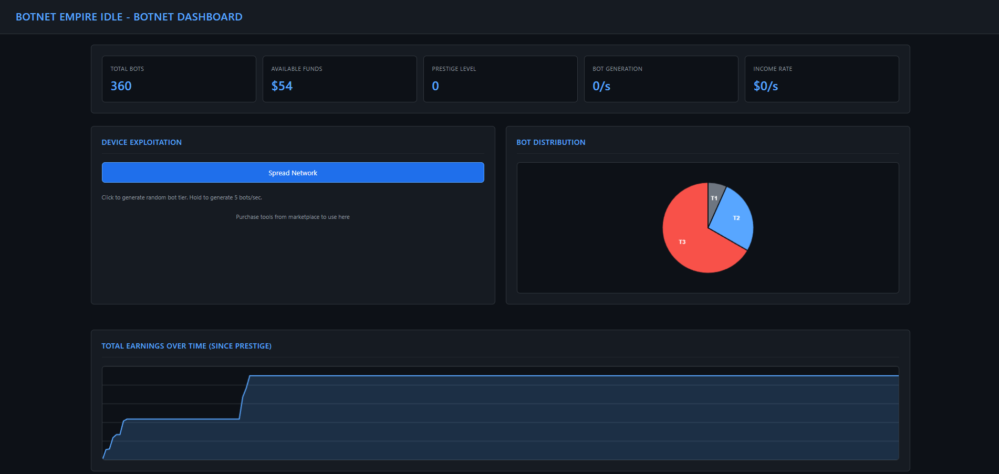
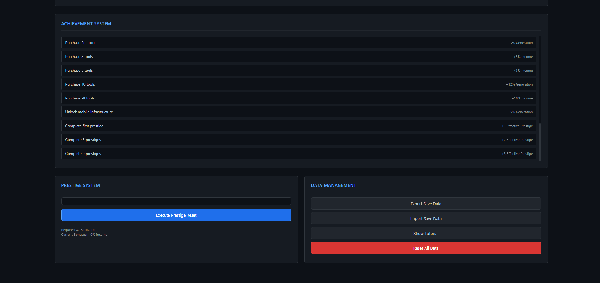

# Botnet Empire Idle 🖥️🐀

A browser-based hacker and botnet themed idle clicker game.

**Play Here:** [https://edwinyaboy.github.io/Botnet-Empire-Idle/](https://edwinyaboy.github.io/Botnet-Empire-Idle/)

---

⚠️ Keep a local version to ensure your saved data is secure, as updates make break your current game save.

⚠️ **Still in development — expect bugs!** Please report issues or suggestions.

---

## Update List

- [ ] More Random Event Types & Offline Events
- [ ] Offline Progress
- [ ] File Crypt Cycle
- [ ] Crypto Mining (Low/High Risk)
- [ ] Crypto Market
- [ ] Scraped Data Market
- [ ] DDoS Minigame
- [ ] Slots Minigame
- [ ] Mobile Compatibility
- [ ] Bug Fixes
- [X] Mo' Modular
- [X] Bot and Revenue Graphs
- [X] Data Management
- [X] Prestige System
- [X] Achievements System
- [X] Randomized Bot Tiers
- [X] Fluctuating Bot Prices
- [X] Random Events
- [X] Automation Mechanics
- [X] Upgrades & Stats
- [X] Basic Idle Clicker Gameplay
- [X] Bug Fixes

---

### Screenshots

